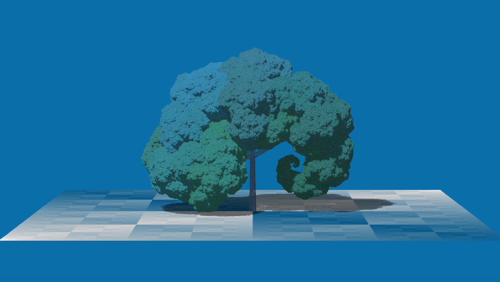

# Dragon Tree IFS

This project renders L-system fractal trees, inspired by Solkoll's implementation (archived [here](https://web.archive.org/web/20080421175129/)) used to generate such images used on Wikipedia (found [here](https://classes.engineering.wustl.edu/cse425s/index.php?title=File:Dragon_trees.jpg)). The original code was based on MS DirectX API. This version has been fully reworked to use OpenGL.

---




---

### Prerequisites

- OpenGL
- C++17 or later
- GLFW
- GLAD or GLEW

### Building

```bash
git clone https://github.com/yousefjan/dragon_tree_IFS.git
cd src
g++ -std=c++17 -I/opt/homebrew/include -L/opt/homebrew/lib -lGLEW -lglfw -framework OpenGL src/tree.cpp -o src/tree
./tree
```

### Explanation

__Core Rendering and Setup:__

- __`main(int argc, char** argv)`__: The entry point of the application. It initializes the system (`doInit`), sets up IFS parameters (`initiateIFS`), and then enters the main loop. Inside the loop, it processes input (`processInput`), performs the IFS calculations and rendering logic (`DoMyStuff`), renders the result to an OpenGL texture (`renderToTexture`), draws that texture to the screen (`drawScreenTexture`), and handles GLFW events.
- __`doInit(void)`__: Initializes GLFW for window creation, sets up an OpenGL context, initializes GLEW, and sets up some basic program constants (like pi, radian conversion, screen ratio). It also initializes the main pixel buffer.
- __`initOpenGL(void)`__: Initializes GLEW, creates shader programs (`createShaders`), sets up a quad for rendering the screen texture (`setupQuad`), and configures the framebuffer (`setupFramebuffer`).
- __`createShaders(void)`__: Compiles a simple vertex and fragment shader. The vertex shader passes through position and texture coordinates, and the fragment shader samples from the screen texture. This is used to display the contents of `pixelBuffer` on the screen.
- __`setupQuad(void)`__: Creates a Vertex Array Object (VAO) and Vertex Buffer Object (VBO) for a full-screen quad. This quad is used to draw the `screenTexture`.
- __`setupFramebuffer(void)`__: Creates an OpenGL texture (`screenTexture`) that will be used as the target for rendering. The contents of the `pixelBuffer` (where the CPU-side rendering happens) are copied to this texture.
- __`renderToTexture(void)`__: Copies the contents of the `pixelBuffer` (which is updated by `DoMyStuff` and `showpic`) to the `screenTexture` using `glTexSubImage2D`.
- __`drawScreenTexture(void)`__: Clears the OpenGL screen, uses the shader program, binds the `screenTexture`, and draws the quad, effectively displaying the rendered image.
- __`finiObjects(void)`__: Cleans up OpenGL resources (textures, framebuffers, shaders, VAO, VBO) when the program exits.

__IFS (Iterated Function System) Logic:__

- __`initiateIFS(void)`__: Loads preset tree definitions (`loadtrees`), sets up a new fractal set (`newsetup`), creates a color palette (`CreatePalette`), and clears initial buffers.
- __`DoMyStuff(void)`__: This is the heart of the fractal generation. It iteratively applies transformations to points to generate the tree structure. It handles rendering for the stem/branches, the ground plane, and foliage based on various flags (`logfoliage`, `useLoCoS`, `showbackground`). It uses a batching system (`pixelBatch`) to collect pixels and then sorts them by Z-depth before drawing to the `pict` buffer.
- __`IFSlight(void)`__: Calculates the lighting for a given 3D point. It considers the light source direction, surface normal (if `donormal` is true), and applies effects like glow. It updates a shadow map (`light` buffer) if `doshadow` is true.
- __`newrender(void)`__: Resets parameters for starting a new rendering pass, such as initial IFS coordinates, colors, palette index, and brightness calibration values.
- __`newsetup(void)`__: Initializes parameters for generating a new tree. This includes setting up scale ratios, defining the ground plane IFS (`createbackground`), randomizing parameters for the "Random Tree" (preset #31), setting up leaf and stem colors (`leafcols`, `stemcols`), and configuring light and camera angles.
- __`randombranch(int indx)`__: Randomizes the parameters (height, scale, lean, rotation, twist) for a specific branch of the "Random Tree" (preset #31).
- __`createbackground(void)`__: Defines the IFS transformations (translation, scale, colors) for rendering the 2D Sierpinski square-based ground plane.
- __`leafcols(void)`__: Randomizes colors for the tree leaves based on the current `colourmode`.
- __`stemcols(void)`__: Sets up a predefined set of colors for different levels of the tree stem/branches.

__Input Handling:__

- __`error_callback(int error, const char* description)`__: A GLFW callback function that is called when a GLFW error occurs. It prints the error to `stderr`.
- __`key_callback(GLFWwindow* window, int key, int scancode, int action, int mods)`__: A GLFW callback for keyboard input. It updates `keyStates` (key currently down) and `keyPressed` (key just pressed this frame).
- __`processInput(void)`__: Checks the `keyPressed` array for various keys and triggers corresponding actions. This function is responsible for changing rendering parameters, camera angles, tree types, colors, zoom levels, and toggling between rendering mode and an info screen mode (in progress).

__Geometric Transformations and Math:__

- __`Q_rsqrt(float number)`__: Implements the "Fast Inverse Square Root" algorithm, a computationally efficient way to calculate `1/sqrt(x)`.
- __`sign(double x)`__: Returns -1 if x is negative, 1 otherwise.
- __`rotateview(void)`__: Applies 3D rotation to global coordinates `xt`, `yt`, `zt` to transform them into the camera's view space using `rxx`, `rxy`, `ryx`, `ryy` (cos/sin of camera angles).
- __`unrotateview(void)`__: Performs the inverse of `rotateview`.
- __`rotatelight(void)`__: Applies 3D rotation to transform coordinates into the light's reference frame using `lrxx`, `lrxy`, `lryx`, `lryy`.
- __`unrotatelight(void)`__: Performs the inverse of `rotatelight`.
- __`LitAng(void)`__: Calculates and stores the cosine and sine (`lrxx`, `lrxy`, `lryx`, `lryy`) of the current light rotation angles (`lrxv`, `lryv`).
- __`CamAng(void)`__: Calculates and stores the cosine and sine (`rxx`, `rxy`, `ryx`, `ryy`) of the current camera rotation angles (`rxv`, `ryv`).

__Buffer Management and Drawing Utilities:__

- __`getPixelBufferPtr(void)`__: Returns a pointer to the main `pixelBuffer`.
- __`clearallbufs(uint32_t RGBdata)`__: Clears the shadow map (`light` buffer), pixel buffer (`pict`), and Z-buffer (`bpict`). Resets `shadowswritten` and `lockshadow`.
- __`clearscreenbufs(uint32_t RGBdata)`__: Clears the `pict` buffer (image data) and `bpict` (Z-buffer) with `RGBdata`. Resets `itersdone` and `pixelswritten`.
- __`clearscreen(uint32_t RGBdata)`__: Fills the `pixelBuffer` (the one copied to the GPU texture) with a specified color.
- __`showpic(void)`__: Copies data from the `pict` buffer (higher resolution, where individual IFS points are plotted) to the `pixelBuffer` (screen resolution). It performs a 2x2 averaging (a simple form of anti-aliasing) in the process.
- __`unpackColor(unsigned int col, float *r, float *g, float *b)`__: Converts a 32-bit integer color (ABGR or similar) into separate float components (0.0 to 1.0) for red, green, and blue. This is used for OpenGL functions that expect float colors.
- __`drawLine(void)`, `drawMulticolLine(void)`, `drawBox(void)`, `drawBoxi(void)`__: Utility functions for drawing lines and boxes directly into the `pixelBuffer`. These seem to be for UI elements or debugging, and their usage in the current rendering loop is minimal or non-existent for the main fractal.
- __`CreatePalette(void)`__: Generates a procedural color palette (`lpCols`) with various randomized effects (inversion, heatwave, sine wave).
- __`ShowPalette(int mode)`__: Renders the `lpCols` palette to a region of the `pixelBuffer` for display.

__File I/O and Data Loading:__

- __`loadtrees(void)`__: Initializes some hardcoded tree structures (`branches` and `trees` arrays) with default and specific preset values (e.g., "Sierpinski Tree", "Levy curve Tree"). It then calls `loadtree()` which seems intended to load from a file.
- __`opensource(const char * fname)`__: Opens the specified file ("trees.IFS" or "trees.txt") and reads its content into a global `tree` array (of `ATREE` structs).
- __`loadtree(void)`__: Copies data from the global `tree` array (populated by `opensource`) into the main `trees` and `branches` arrays used by the rendering logic. This function has a `printf` statement that indicates it's loading trees one by one.

__UI Text and Info Display:__

- In progress...
