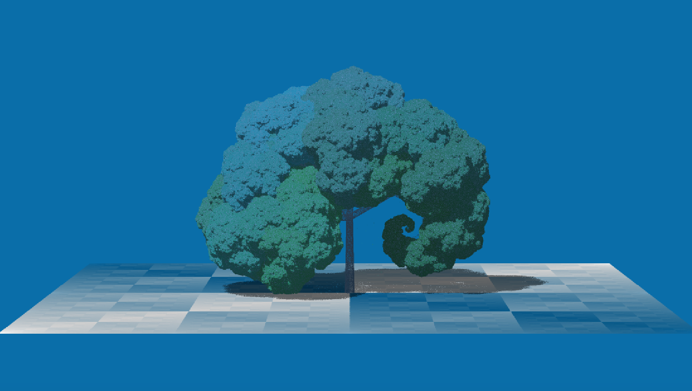

# Dragon Trees

Real-time fractal tree renderer built with C++17, GLFW, GLEW, and OpenGL.

Trees are generated using an Iterated Function System (IFS) / chaos-game style loop, writes to CPU-side color/depth buffers, then presents the final frame through a textured OpenGL fullscreen quad. This project is inspired by Solkoll's implementation (archived [here](https://web.archive.org/web/20080622061317/http://web.comhem.se/solgrop/3dtree.htm)) used to generate such images used on Wikipedia (found [here](https://classes.engineering.wustl.edu/cse425s/index.php?title=File:Dragon_trees.jpg)). The original code was based on MS DirectX API. This version has been fully reworked to use OpenGL.



## Requirements (macOS)

- Xcode Command Line Tools
- CMake 3.20+
- Homebrew packages:
  - `glfw`
  - `glew`

Install dependencies:

```bash
brew install cmake glfw glew
```

## Build

From the repository root:

```bash
cmake -S . -B build
cmake --build build --config Release
```

## Run

```bash
./build/dragon_trees
```

## Controls

- `Space`: toggle render/info screen
- `Esc`: quit
- `Arrow keys`: rotate camera
- `Page Up` / `Page Down`: zoom
- `Home`: reset view
- `M`: next tree preset
- `R`: random tree preset
- `N`: cycle branch-count mode
- `I`: show scene/tree info
- `B`, `G`, `L`, `W`, `O`, `P`: scene and palette tweaks

## Project Structure

- `src/tree.cpp`: core fractal simulation, tree setup, input handling, and UI state
- `src/gl_present.cpp`: OpenGL init/shader/quad setup and final buffer presentation
- `src/utils.h`: shared constants, structs, and function declarations
- `src/trees.txt`: legacy human-readable preset source reference

## Notes

- This codebase is currently optimized for macOS portfolio presentation and local reproducibility.
- The renderer intentionally keeps the original CPU-buffer + accumulation approach to preserve the visual style.


## Explanation

### 1. Overview

The program uses the **Chaos Game** algorithm (a method of creating Iterated Function Systems) to visualize tree-like structures. Unlike standard 3D modelers that use polygons (meshes), this program generates volume and shape by plotting millions of individual points. Each point represents a potential particle in the fractal structure.

This approach follows the design of the original early-2000s implementation and reflects how Iterated Function System (IFS) fractals are naturally defined. Rather than describing a continuous surface, an IFS converges to a probability distribution of points known as the attractor. Plotting points therefore represents the structure directly, without needing surface reconstruction. Historically this method also allowed complex fractal scenes to be rendered on modest hardware, since it requires very little geometry storage and relies only on simple iterative transformations.

The core idea is that a tree is self-similar: a branch looks like a smaller version of the whole tree. By mathematically defining how a "branch" transforms relative to its "stem", we can infinitely repeat this process to create organic-looking structures.

### 2. Core Logic: Iterated Function Systems (IFS)

The heart of the program relies on **IFS**. An IFS is a set of affine transformations (scaling, rotation, translation).

#### The Chaos Game Algorithm
The program renders trees using a specific Monte Carlo method known as the Chaos Game:
1.  Start with a random 3D point $(x, y, z)$ in space.
2.  Iteratively apply one of several defined **transformations** (rules) to this point.
    -   One rule represents the "stem" (usually just moving up).
    -   Other rules represent "branches" (scaling down, rotating, and moving up).
3.  At each step, a rule is chosen randomly.
4.  After many iterations, the point converges to the "attractor" of the system (the shape of the tree).
5.  The program continuously plots these points to the screen, building up the image over time.

#### The Tree Metaphor
In this codebase, an IFS is defined by:
-   **Stem**: The main trunk.
-   **Branches**: Offshoots from the trunk.

Each branch is defined by:
-   **Scale**: How much smaller it is than the parent.
-   **Lean**: Angle away from the vertical axis (Z-axis rotation).
-   **Rotate**: Angle around the trunk (Y-axis rotation).
-   **Twist**: Torsion around its own axis.
-   **Height**: Where on the parent stem it starts.

### 3. Mathematical Transformations

The program does not use standard 4x4 matrices for transformations. Instead, it manually applies rotation and translation formulas to 3D coordinates $(x, y, z)$ and their normal vectors $(nx, ny, nz)$.

#### Coordinate System
-   **Y-axis**: Vertical (Up/Down). The trees grow along the Y-axis.
-   **X/Z-axes**: Ground plane.

#### Transformation Steps (in `DoMyStuff`)

For every iteration, the program applies the inverse transformations in reverse order of operation to move a point "up" the tree structure.

##### 1. Twist (Rotation around Y-axis local to branch)
Rotates the point $(x, z)$ by the twist angle $\theta_t$.
$$
x' = x \cos(\theta_t) - z \sin(\theta_t) \\
z' = x \sin(\theta_t) + z \cos(\theta_t)
$$

##### 2. Lean (Rotation around Z-axis)
 tilts the branch away from the trunk by angle $\phi$.
$$
x'' = x' \cos(\phi) - y \sin(\phi) \\
y' = x' \sin(\phi) + y \cos(\phi)
$$

##### 3. Rotate (Rotation around Y-axis global)
Rotates the branch around the parent trunk by angle $\psi$.
$$
x''' = x'' \cos(\psi) - z' \sin(\psi) \\
z'' = x'' \sin(\psi) + z' \cos(\psi)
$$

##### 4. Scale
Shrinks the point.
$$
x_{final} = x''' \cdot s \\
y_{final} = y' \cdot s \\
z_{final} = z'' \cdot s
$$
*Note: Scaling logic varies based on `glblscl` (global scale) or per-branch scale flags.*

##### 5. Translate
Moves the branch up the stem.
$$
y_{final} += H
$$
Where $H$ is the tree height or branch attachment height.

#### Normal Vectors
Crucially, the program also transforms a **Normal Vector** $(nx, ny, nz)$ alongside the position. The normal vector represents the direction the surface is facing at that point. It undergoes Rotation and Twist but **not** Translation (vectors represent direction, not position). This allows for realistic lighting calculations later.

### 4. Rendering Pipeline

The rendering happens in the `DoMyStuff` function in `src/tree.cpp`.

1.  **Point Generation**:
    -   A batch of iterations (e.g., 20,000) is run per frame.
    -   For each iteration, a random branch rule is selected.
    -   The mathematical transformations described above are applied.
    -   The resulting 3D point $(x_t, y_t, z_t)$ represents a spot on the tree.

2.  **Lighting Calculation (`IFSlight`)**:
    -   The program calculates the dot product between the transformed Normal Vector and a Light Vector.
    -   $Intensity = \vec{N} \cdot \vec{L}$
    -   This determines the brightness of the pixel (Lambertian reflection).

3.  **3D to 2D Projection**:
    -   The 3D point is rotated according to the Camera Angle (`rotateview`).
    -   Perspective projection is applied:
        $$
        scale = \frac{constant}{distance}
        $$
        $$
        x_{screen} = x_{world} \cdot scale + CenterX
        $$
        $$
        y_{screen} = y_{world} \cdot scale + CenterY
        $$

4.  **Z-Buffering**:
    -   The program maintains a **Depth Buffer** (`bpict` or `nZ`).
    -   Before drawing a pixel, it checks if the new point is closer to the camera than what's already drawn.
    -   If closer, it updates the pixel color and the Z-buffer value.

### 5. Code Structure

#### Key Files
-   `src/tree.cpp`: The main entry point. Contains the game loop, rendering logic (`DoMyStuff`), and input handling.
-   `src/atree.h` & `src/utils.h`: Defines the data structures.
-   `src/trees.IFS`: A text configuration file defining the preset trees.

#### Important Functions
-   `loadtrees()`: Hardcoded initialization of tree parameters (Sierpinski, Dragon Tree, etc.) into the `trees[]` array.
-   `initiateIFS()`: Pre-calculates trigonometric values (sin/cos) for efficiency.
-   `DoMyStuff()`: The main "render" loop. It runs the Chaos Game algorithm, accumulating pixels into the buffer.
-   `processInput()`: Handles keyboard interaction (rotating view, changing trees, zooming).

#### Data Structures
-   `struct ATREE`: Represents a full tree definition.
    -   `branches`: Number of branches.
    -   `radius`, `height`: Dimensions.
    -   `scale0`, `rotate0`, `lean0`...: Raw parameters for branches.
-   `struct DTBRA`: Represents a single branch's parameters (scale, lean, rotate, twist).
-   `struct DTIFS`: A cleaner representation of a tree containing an array of `DTBRA`.

### 6. Algorithms in Detail

#### The "Inverse" Approach
The code iterates backwards from the "leaves" to the "root" or vice versa depending on interpretation, but mathematically it simulates the limit set of the contractions.
```cpp
for (pti = (ilevels - 1); pti >= 0; pti--) {
    // Select random branch
    di = 4 + int(RND * trees[treeinuse].branches);
    
    // Apply Transformations (Twist -> Lean -> Rotate -> Scale -> Translate)
    // ... math code ...
    
    // Plot
}
```

#### Shadow Mapping
The program supports crude shadow mapping:
1.  It projects points from the *Light's* perspective into a shadow Z-buffer (`light[][]`).
2.  When rendering from the *Camera's* perspective, it checks if the point is "visible" to the light by comparing with the shadow buffer.

#### Anti-Aliasing / Accumulation
Because it plots points, the image effectively accumulates over time. The "Anti-Aliasing" here is actually just the high density of points smoothing out the shape. The `pixelswritten` counter tracks how much "paint" has been applied to the screen.

### 7. Summary

To understand this code, imagine you are drawing a tree by rolling a die.
1.  You stand at the base.
2.  Roll a die:
    -   If 1: Move up a bit (Stem).
    -   If 2: Shrink down, turn right, and move up (Branch 1).
    -   If 3: Shrink down, turn left, and move up (Branch 2).
3.  Mark a dot where you land.
4.  Repeat millions of times.
The resulting cloud of dots forms the 3D tree. The code simply defines the rules (how much to shrink/turn) and handles the math to put the dots on the screen.

